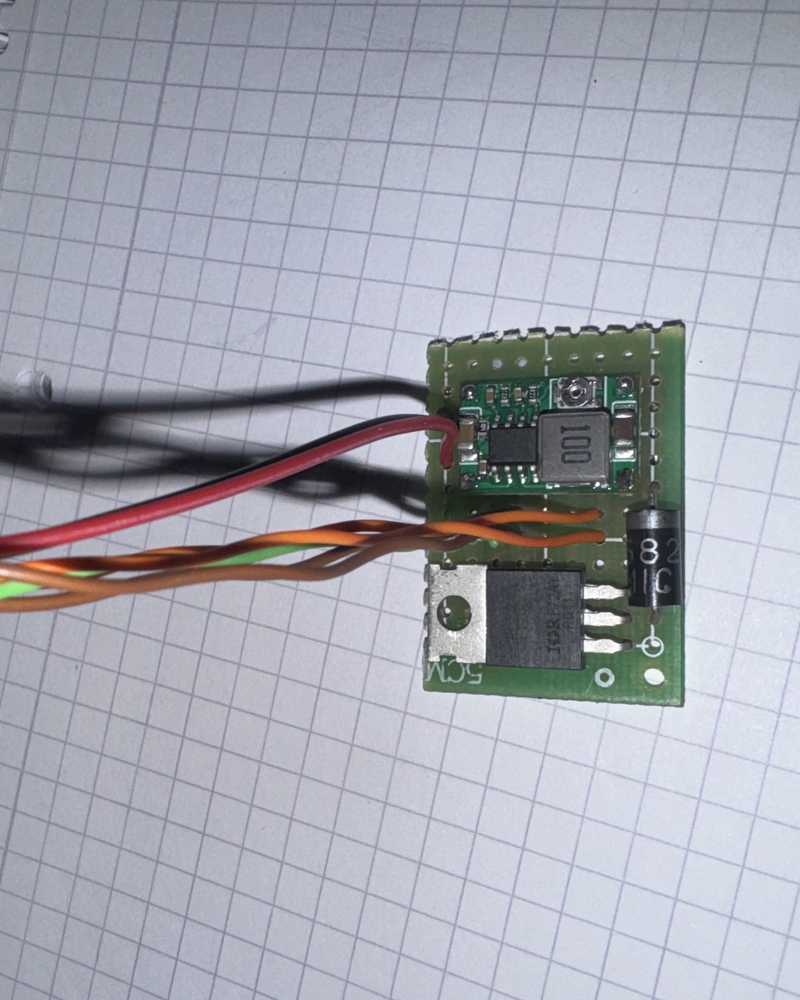
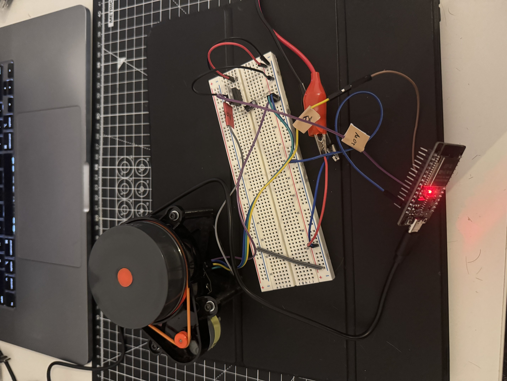
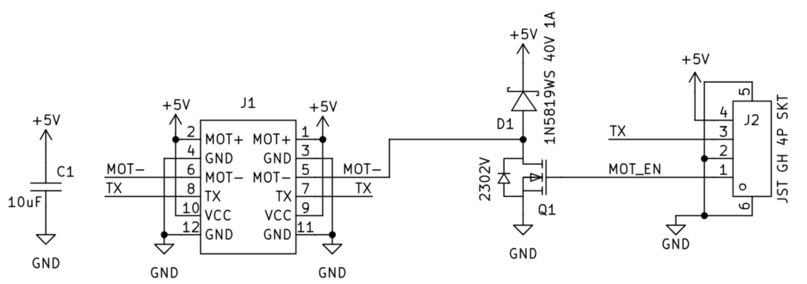
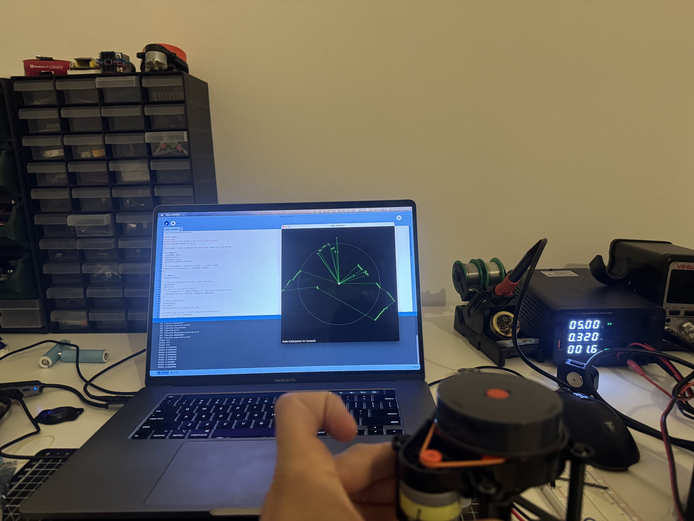

# LiDAR LDS02RR ESP32 Interface

This project is an extension of the LDS02RR library, developed to enable the use of cheap LiDAR sensors from robot vacuums in robotics projects. It provides a complete solution for interfacing with the Xiaomi LDS02RR LiDAR sensor using an ESP32 microcontroller, including motor control and real-time data visualization.

## Features

- Reads 360-degree scan data from LDS02RR LiDAR
- Outputs scan points with angle and distance measurements
- Configurable scan frequency (set to 5 Hz)
- Debug options for missed angles and packet inspection
- PWM motor control for LiDAR
- Custom motor driver circuit on perfboard for ESP32 control
- Real-time data processing and plotting script in Processing for visualization

## Hardware Setup

The hardware consists of an ESP32 microcontroller connected to the LDS02RR LiDAR sensor via UART, with a custom motor driver circuit built on perfboard to enable precise control of the LiDAR motor.

### Components
- ESP32 (NodeMCU-32S)
- LDS02RR LiDAR sensor
- Custom motor driver circuit on perfboard

### Connections
- LiDAR TX → ESP32 GPIO 21 (RX)
- LiDAR PWM motor pin → ESP32 GPIO 15 (via motor driver circuit)

### Motor Driver Circuit
The motor driver circuit was built on perfboard to allow the ESP32 to control the LiDAR motor speed. This enables stable operation and adjustable scan rates.







## Software Dependencies

- PlatformIO
- Arduino framework for ESP32
- LDS library (kaiaai/LDS@^0.6.3)
- Processing IDE (for visualization)

## Configuration

- Serial monitor baud rate: 250000
- LiDAR serial RX buffer: 8192 bytes
- PWM frequency: 10kHz, 11-bit resolution
- Processing serial port: Adjust index in `lidar_visualiser.pde` (default: 9)

## Output Format

Scan data is output in CSV format:
```
SCAN_START
angle1,distance1
angle2,distance2
...
SCAN_END
```

Individual points are also printed every 50th point.

## Real-time Visualization

The project includes a Processing script (`processing_visualiser/lidar_visualiser.pde`) for real-time visualization of LiDAR data. The script reads serial data from the ESP32 and plots the scan points in a 360-degree view.

### Features
- Real-time plotting of LiDAR scan data
- Zoom controls (+/- keys)
- Distance scale rings for reference
- Connected point visualization



## Build and Upload

Use PlatformIO to build and upload the project to ESP32.

## Usage

1. Build and upload the ESP32 code using PlatformIO
2. Open the serial monitor at 250000 baud to view raw data
3. For visualization, open `processing_visualiser/lidar_visualiser.pde` in Processing IDE
4. Adjust the serial port index in the Processing script if necessary
5. Run the Processing sketch to see real-time LiDAR visualization